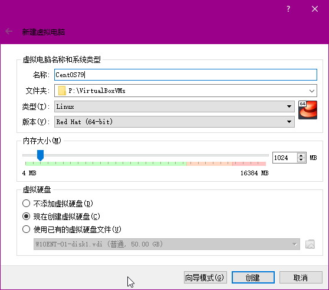
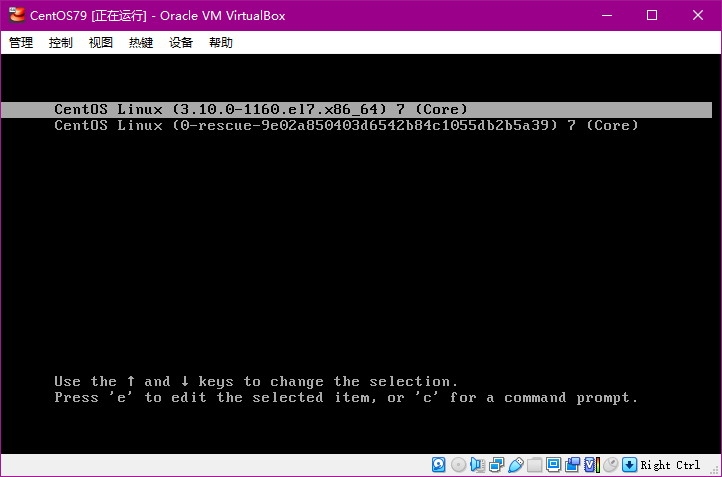
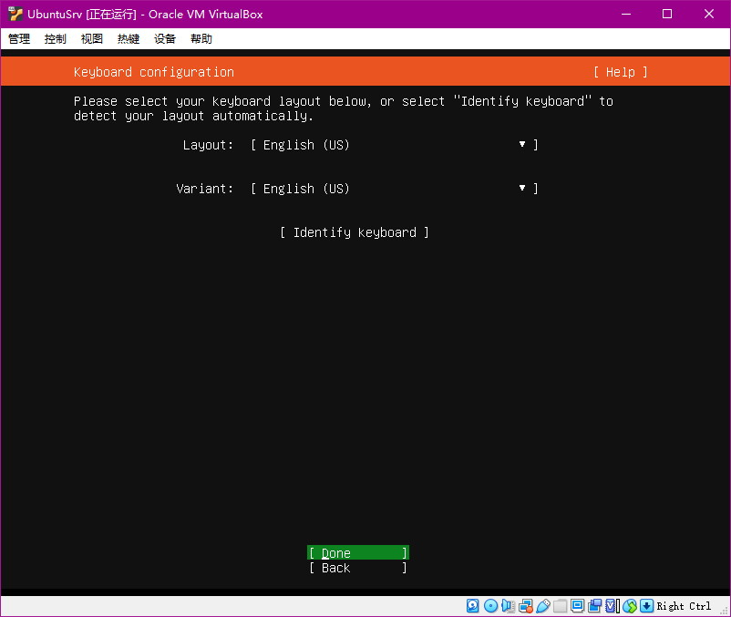
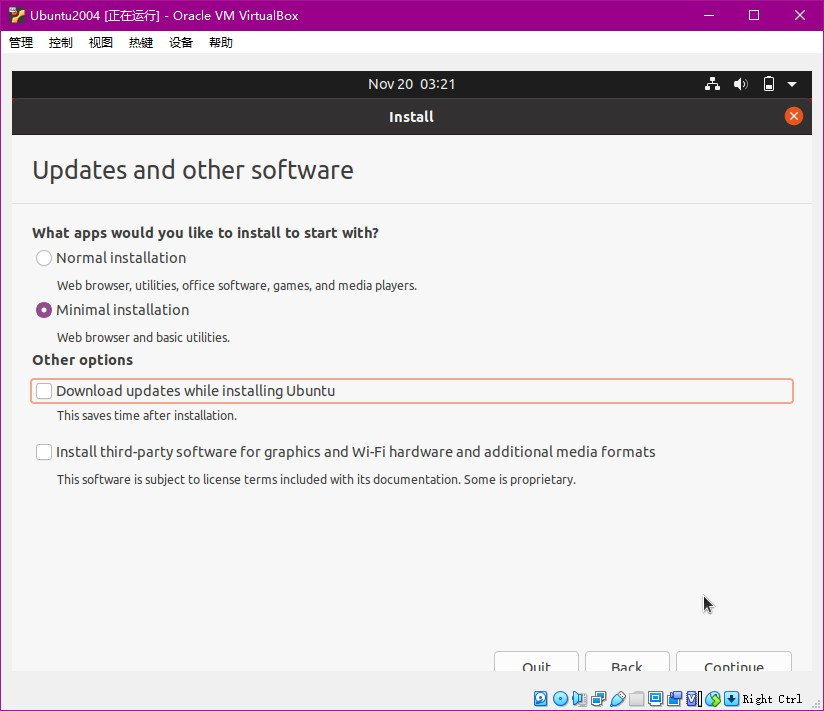
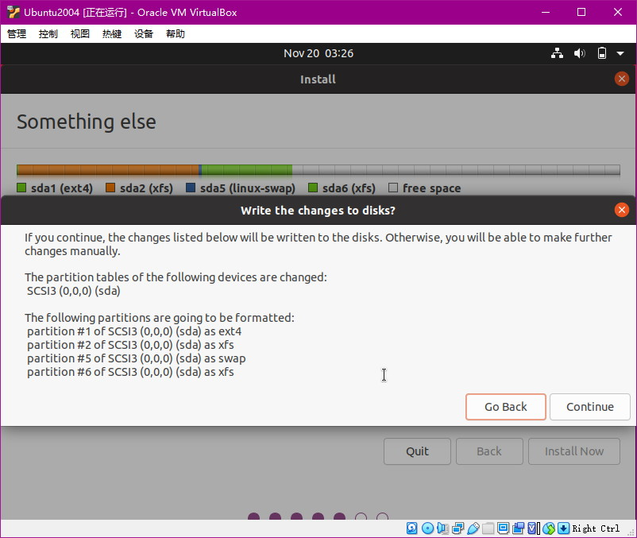

# Linux Administrator


## 获取并安装Linux

### 配置虚拟机环境（VirtualBox）

略


### 下载Linux镜像文件ISO

**下载CentOS Minimal**

https://www.centos.org/centos-linux/
http://isoredirect.centos.org/centos/7/isos/x86_64/
http://ty1.mirror.newmediaexpress.com/centos/7.9.2009/isos/x86_64/


下载完后进行SHA265校验（在这里确保镜像完整的话，安装时直接安装一般没什么问题）

```
certutil -hashfile CentOS-7-x86_64-Minimal-2009.iso SHA256
```


**下载Ubuntu Desktop**

https://ubuntu.com/download/desktop
Ubuntu 20.04.3 LTS

截图略


**下载Ubuntu Server**

https://ubuntu.com/download/server

验证镜像文件SHA265（官方）

```
echo "f8e3086f3cea0fb3fefb29937ab5ed9d19e767079633960ccb50e76153effc98 *ubuntu-20.04.3-live-server-amd64.iso" | shasum -a 256 --check
```

没问题时的输出（官方）

```
ubuntu-20.04.3-live-server-amd64.iso: OK
```

验证的方法指导（官方）

https://ubuntu.com/tutorials/how-to-verify-ubuntu#1-overview

上面的"f8e3086f3cea0fb3fefb29937ab5ed9d19e767079633960ccb50e76153effc98"应该就是文件的SHA265，下面在Windows下验证

```
certutil -hashfile ubuntu-20.04.3-live-server-amd64.iso SHA256
```


### 安装方法

安装到物理机

​	将下载的ISO文件烧录到DVD光盘，或者制作U盘启动；在BIOS设置电脑开机第一启动顺序为DVD或者U盘（临时或者永久，以具体主板设置为准）；启动后安装，流程同虚拟机；安装后去除DVD或者U盘，恢复电脑启动顺序设置（如果需要）。截图略

安装到虚拟机

​	见下方


### 安装Centos 7.9

新建虚拟机



创建硬盘，选择动态分配


挂载ISO镜像文件


启用网卡1，选择网络地址转换(NAT)，以便上网


启用网卡2，选择仅主机(Host-Only)网络，以便从宿主电脑访问客户机


开机，按需选择测试镜像还是安装CentOS系统


进入安装界面，选择语言


硬盘分区，选择手动(I will configure partitioning)


选择标准模式(Standard Partition)


按序追加分区


分区完成后，执行更改(Accept Changes)


开启网卡，修改主机名


设置网卡自启动


其他设置，关闭kdump等


点击开始安装(Begin Installation)，设置用户和密码，选择(Make this user adminstrator)以便执行sudo命令


安装后重启(Reboot)，旧的VirtualBOX需要手动移除光盘，新的直接重启，光盘自动移除


开机界面




登录，检查用户是否可以登录，硬盘分区和网卡是否启动


### 安装Ubuntu Server 20.04

新建虚拟机，同上，略

开机 ，


选择语言和键盘




设置网卡和查看网卡（默认启用全部网卡），按TAB键移动光标，按Enter键选择和确定


代理设置


备用镜像网址设置


硬盘分区和格式化，选择(Custom storage layout)进行手动分区（想偷懒则选默认设置）


选中(AVAILABLE DEVICES)，按Enter键显示菜单，选择(Add GPT Partition)新建分区


支持输入数字+单位，输入分区信息后按(Create)


重复新建分区步骤，完成其他分区的设置


新建完所需分区后，按(Done)


新建用户


安装SSH服务器


根据需要选择追加软件包


安装ing


安装更新，不喜欢可以取消


安装完毕，重启


重启报错，提示无法卸载光盘，查看挂载情况发现光盘已卸载（开机状态下也无法拔出，不是热插拔）


无视错误，按Enter，交给虚拟机处理


重启成功，用户登录


查看分区，网卡是否正常，SSHD服务是否启动


### 安装Ubuntu Desktop 20.04

具体步骤同上，图如下








### 初次登录Linux

**CentOS**

可用创建的账号登录（能不能执行sudo看创建时有没有Make this user adminsitrator），也可用root登录

**Ubuntu**

只能用创建的账号登录（创建的账号具有administrator权限，可以执行sudo）

root没有创建密码，无法用su命令切换，可用sudo + su命令切换

```bash
sudo su -
```


