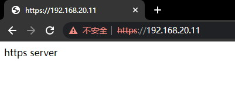
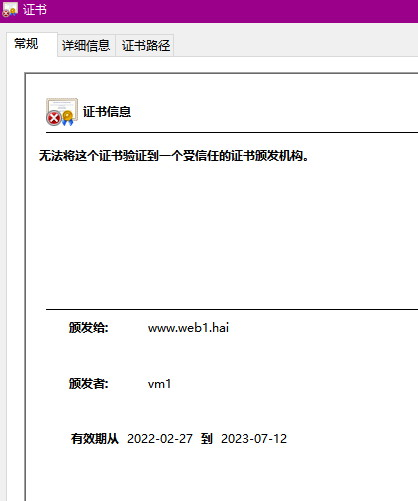
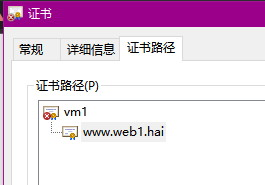

# Linux Administrator

## 创建私有CA并进行证书申请

创建根证书和密钥

```sh
[root@vm1 ca-trust]# cd
[root@vm1 ~]# cd /etc/pki/ca-trust/
[root@vm1 ca-trust]# openssl req -newkey rsa:4096 -nodes -sha256 -keyout ca-vm1.key -x509 -days 1000 -out ca-vm1.crt
Generating a RSA private key
..........................................................................................................++++
....................................................................................................................................++++
writing new private key to 'ca-vm1.key'
-----
You are about to be asked to enter information that will be incorporated
into your certificate request.
What you are about to enter is what is called a Distinguished Name or a DN.
There are quite a few fields but you can leave some blank
For some fields there will be a default value,
If you enter '.', the field will be left blank.
-----
Country Name (2 letter code) [XX]:CN
State or Province Name (full name) []:GUANGDONG
Locality Name (eg, city) [Default City]:GUANGZHOU
Organization Name (eg, company) [Default Company Ltd]:CH
Organizational Unit Name (eg, section) []:IT
Common Name (eg, your name or your server's hostname) []:vm1
Email Address []:root@vm1

```

创建服务器证书签名请求文件和密钥

```sh

[root@vm1 ~]# mkdir /data/nginx/certs
[root@vm1 ~]# cd /data/nginx/certs
[root@vm1 certs]# openssl req -newkey rsa:4096 -nodes -keyout www.web1.hai.key -out www.web1.hai.csr
Generating a RSA private key
..++++
..........................................................................................................................................................................................................................................++++
writing new private key to 'www.web1.hai.key'
-----
You are about to be asked to enter information that will be incorporated
into your certificate request.
What you are about to enter is what is called a Distinguished Name or a DN.
There are quite a few fields but you can leave some blank
For some fields there will be a default value,
If you enter '.', the field will be left blank.
-----
Country Name (2 letter code) [XX]:CN
State or Province Name (full name) []:GUANGDONG
Locality Name (eg, city) [Default City]:GUANGZHOU
Organization Name (eg, company) [Default Company Ltd]:CH
Organizational Unit Name (eg, section) []:IT
Common Name (eg, your name or your server's hostname) []:www.web1.hai
Email Address []:root@www.web1.hai

Please enter the following 'extra' attributes
to be sent with your certificate request
A challenge password []:123456
An optional company name []:CH
[root@vm1 certs]# ls
www.web1.hai.csr  www.web1.hai.key

```

签发证书

```sh
[root@vm1 certs]# openssl x509 -req -days 500 -in www.web1.hai.csr -CA /etc/pki/ca-trust/ca-vm1.crt -CAkey /etc/pki/ca-trust/ca-vm1.key -CAcreateserial -out www.web1.hai.crt
Signature ok
subject=C = CN, ST = GUANGDONG, L = GUANGZHOU, O = CH, OU = IT, CN = www.web1.hai, emailAddress = root@www.web1.hai
Getting CA Private Key
[root@vm1 certs]# ls
www.web1.hai.crt  www.web1.hai.csr  www.web1.hai.key

[root@vm1 certs]# cat www.web1.hai.crt /etc/pki/ca-trust/ca-vm1.crt > www.web1.hai.pem

```

验证签发的证书

```sh
[root@vm1 certs]# openssl x509 -in www.web1.hai.crt -noout -text
Certificate:
    Data:
        Version: 1 (0x0)
        Serial Number:
            77:0d:04:c4:d6:73:42:a2:c2:0d:e3:11:8a:db:35:87:ea:37:a5:11
        Signature Algorithm: sha256WithRSAEncryption
        Issuer: C = CN, ST = GUANGDONG, L = GUANGZHOU, O = CH, OU = IT, CN = vm1, emailAddress = root@vm1
        Validity
            Not Before: Feb 27 14:11:12 2022 GMT
            Not After : Jul 12 14:11:12 2023 GMT
        Subject: C = CN, ST = GUANGDONG, L = GUANGZHOU, O = CH, OU = IT, CN = www.web1.hai, emailAddress = root@www.web1.hai
        Subject Public Key Info:
            Public Key Algorithm: rsaEncryption
                RSA Public-Key: (4096 bit)
                Modulus:
                    00:b0:ef:77:9e:cf:3b:41:f8:c0:48:c2:ec:c9:12:
                    9c:05:12:9e:37:f4:70:b2:28:ae:a6:47:8c:50:c8:
                    78:26:29:e9:3a:34:2f:53:f9:a4:aa:58:45:86:a0:
                    b6:d0:db:e3:80:cf:ae:7b:1b:8b:9a:b8:ac:ff:b6:
                    a9:09:ef:20:65:77:1a:de:6c:b3:50:20:3f:30:ab:
                    d9:4e:ae:2b:6d:87:ff:3d:b4:8e:91:96:83:d4:50:
                    0a:81:e5:1d:c6:76:b2:42:c0:d8:30:58:32:fb:b6:
                    fe:bc:b0:1f:12:f8:f5:e8:eb:47:d8:e2:ea:6f:03:
                    d6:71:ed:35:b9:cf:24:c5:f7:f6:a3:7e:f3:53:7d:
                    a2:b1:c6:7d:15:96:f1:55:7d:d9:68:d6:c8:e2:42:
                    d1:a5:40:ba:44:4a:ca:2e:81:b4:e1:ab:54:09:b2:
                    e9:a0:84:d4:e1:da:70:8a:e0:2c:71:92:ee:1c:4b:
                    3c:11:de:8e:52:07:6a:0e:7b:86:ee:55:23:f2:63:
                    ba:fe:34:94:93:b0:d9:41:6d:66:68:ea:61:fd:4f:
                    9d:f4:37:a2:6f:89:34:d0:64:13:00:d0:39:2d:b9:
                    99:50:44:78:66:fc:ba:48:a4:d5:ce:8e:79:21:18:
                    58:0a:7c:ea:c3:d6:90:4f:47:2c:23:11:b6:73:7a:
                    69:6d:9d:66:cc:9a:52:7e:48:70:59:da:64:4a:ee:
                    af:bc:1d:de:48:60:13:7b:a5:38:81:66:7e:6d:c3:
                    9e:e9:5e:26:96:99:fd:4f:35:89:56:e1:a3:d5:5d:
                    d4:1d:ba:9d:ea:74:3c:2d:e3:12:d0:95:a8:1b:bb:
                    d0:d7:3c:46:d9:8d:34:48:fe:89:ae:ee:53:da:d7:
                    f8:3c:2b:88:cb:35:05:c7:c7:4d:5a:35:b9:08:58:
                    8b:bc:55:ad:ab:30:c8:ad:6f:04:d3:d2:3a:e8:2d:
                    d1:12:33:0e:36:d0:fa:e5:6d:b0:ad:df:f5:36:82:
                    d3:41:38:df:59:e3:e9:7a:7a:7e:59:71:e5:99:2e:
                    ed:25:e0:42:e1:61:3d:54:21:a7:a1:7c:bc:ff:15:
                    a5:9b:6c:e6:b5:17:b5:82:f5:d8:ad:c5:91:fa:48:
                    25:ce:f1:b2:b2:31:ad:62:f2:52:d0:36:d8:05:f8:
                    29:bd:d6:b4:8a:d1:c7:64:ea:23:da:d2:64:0e:5c:
                    8d:b1:45:29:91:4d:28:7d:f9:76:a0:f5:20:4b:35:
                    98:0e:a2:90:52:4a:85:b8:d5:57:e5:c4:6a:54:b9:
                    f9:c7:8f:6e:f0:cb:af:f9:b4:e8:81:a3:e0:d5:39:
                    e0:90:a3:4e:6e:c5:b1:0e:bd:4e:39:08:96:f4:0c:
                    a4:a4:21
                Exponent: 65537 (0x10001)
    Signature Algorithm: sha256WithRSAEncryption
         93:d9:42:22:54:48:50:41:bb:96:4f:3e:ee:38:8b:45:46:53:
         f5:d1:0d:73:99:6a:a2:37:62:97:d5:bd:e0:09:3e:45:bc:db:
         77:81:03:0b:33:1f:c8:e4:0b:2b:28:ee:eb:06:5f:16:3f:67:
         09:b0:e0:0c:94:5e:cd:1c:8b:5b:0c:f3:8d:1e:20:7a:c6:37:
         0a:2a:7c:49:b4:16:9b:95:aa:52:c3:ea:e6:69:a4:09:12:b5:
         06:bb:e5:53:90:3f:6e:c5:6f:2e:2c:17:b6:31:09:14:a1:16:
         82:07:a7:80:bc:26:97:82:c4:11:54:ff:fa:52:ee:33:8c:26:
         87:d4:01:6d:3c:91:4a:e2:3b:c0:58:ec:0a:73:6c:8a:bf:4b:
         d5:09:b9:33:ba:87:fc:08:fb:e0:b1:85:fb:2e:2a:36:d2:70:
         9c:76:7c:be:77:ca:98:58:a0:d7:0c:5c:d2:ee:b7:5e:8f:f0:
         c7:b8:c6:38:24:36:86:dc:cf:7b:7f:c5:e9:94:3d:50:26:0f:
         7c:89:01:cf:94:43:e7:b0:65:0f:f5:79:9e:77:3b:c9:da:12:
         0b:92:19:26:dd:71:72:41:07:18:1a:d6:62:28:88:d4:24:35:
         9c:80:b4:2a:ff:a1:d1:1f:3a:09:eb:28:76:fa:5e:9e:1e:62:
         73:32:84:97:4c:9a:39:66:fa:69:96:56:55:f1:eb:81:5d:92:
         0d:30:63:49:1b:fd:20:7e:3a:de:ac:fb:fa:a2:60:4f:c4:5d:
         4e:20:87:4e:6e:6d:11:68:8b:27:b3:22:ec:54:f8:72:d7:71:
         67:49:68:88:de:b0:42:e0:88:6b:81:1b:08:c1:ec:98:e2:11:
         6d:bb:06:ba:41:40:4e:99:c6:ab:ff:47:b7:c9:d3:df:2c:c3:
         6e:37:b4:fe:5d:d3:32:dd:13:7f:d9:4e:62:94:69:15:37:a1:
         3a:7f:28:ff:ee:ba:63:e9:27:b2:25:48:16:ac:05:ac:38:e5:
         88:c1:83:f3:b0:dd:76:de:20:e8:37:e5:b5:f6:3b:cb:34:9d:
         ef:27:33:3e:2e:45:5a:05:10:df:ac:e2:bc:50:60:e2:d3:29:
         13:e7:90:c9:6c:8c:b7:12:b9:99:41:03:69:2b:41:08:8b:b0:
         c8:39:10:02:97:ee:85:34:8d:63:70:17:f3:dc:29:86:39:e3:
         4f:69:88:39:a9:9c:20:80:db:12:92:11:eb:55:de:51:60:c0:
         8c:ec:24:49:8a:f8:fb:df:5a:e3:51:d8:66:16:ef:78:c2:0d:
         02:88:70:1e:88:3c:5d:49:4a:06:f3:34:ac:c0:53:8a:17:44:
         9b:b7:fd:05:01:e3:97:c6

```

在nginx网页服务器里使用证书

```sh
[root@vm1 ~]# grep -A1 '# include ssl server' /usr/local/nginx/conf/nginx.conf
    # include ssl server
    include ssl.conf;
[root@vm1 ~]# cat /usr/local/nginx/conf/ssl.conf
server {
    listen       443 ssl;
    server_name  www.web1.hai;
    ssl_certificate      /data/nginx/certs/www.web1.hai.pem;
    ssl_certificate_key  /data/nginx/certs/www.web1.hai.key;
    ssl_session_cache    shared:SSL:1m;

    location / {
        root   html/ssl;
        index  index.html index.htm;
    }
}

[root@vm1 ~]# cat /usr/local/nginx/html/ssl/index.html
https server

[root@vm1 ~]# nginx -t
nginx: the configuration file /usr/local/nginx/conf/nginx.conf syntax is ok
nginx: configuration file /usr/local/nginx/conf/nginx.conf test is successful
[root@vm1 ~]# systemctl restart nginx

[root@vm1 ~]# tail -1 /etc/hosts
192.168.20.11 www.web1.hai

```

测试

```sh
[root@vm1 ~]# curl https://www.web1.hai --insecure
https server

```

浏览器测试







## ssh常用参数

```sh
-p # 指定服务器端口
-b # 指定源ip
-o # 配置连接选项
-i # 指定密钥路径
<  # 远程执行脚本

```

指定端口

```sh
[root@vm1 ~]# ssh 192.168.20.11 -p 22

```


指定源ip

```sh
[root@vm1 ~]# ssh 192.168.20.11 -b 192.168.20.12

# 日志查看登录记录
[root@vm1 ~]# tail -4 /var/log/secure
Feb 27 22:38:01 vm1 sshd[1545]: pam_unix(sshd:session): session opened for user root by (uid=0)
Feb 27 22:38:02 vm1 sshd[1548]: Received disconnect from 192.168.20.12 port 49293:11: disconnected by user
Feb 27 22:38:02 vm1 sshd[1548]: Disconnected from user root 192.168.20.12 port 49293
Feb 27 22:38:02 vm1 sshd[1545]: pam_unix(sshd:session): session closed for user root

```

初次连接不要询问要不要添加主机信任

```sh
[root@vm1 ~]# ssh 192.168.20.11 -o StrictHostKeyChecking=no
Warning: Permanently added '192.168.20.11' (ECDSA) to the list of known hosts.
root@192.168.20.11's password:

```

指定密钥路径

```sh
# 创建其他位置的密钥
[root@vm1 ~]# ssh-keygen
Generating public/private rsa key pair.
Enter file in which to save the key (/root/.ssh/id_rsa): /root/root_rsa
Enter passphrase (empty for no passphrase):

# 复制公钥
[root@vm1 ~]# ssh-copy-id -i /root/root_rsa.pub -o StrictHostKeyChecking=no 192.168.20.11
/usr/bin/ssh-copy-id: INFO: Source of key(s) to be installed: "/root/root_rsa.pub"
/usr/bin/ssh-copy-id: INFO: attempting to log in with the new key(s), to filter out any that are already installed
/usr/bin/ssh-copy-id: INFO: 1 key(s) remain to be installed -- if you are prompted now it is to install the new keys
root@192.168.20.11's password:

Number of key(s) added: 1

Now try logging into the machine, with:   "ssh -o 'StrictHostKeyChecking=no' '192.168.20.11'"
and check to make sure that only the key(s) you wanted were added.

# 指定密钥连接
[root@vm1 ~]# ssh 192.168.20.11 -i /root/root_rsa
Last login: Sun Feb 27 22:38:01 2022 from 192.168.20.12

```


## sshd服务常用参数

```sh
-p # 指定服务端口
-h # 指定密钥文件
-o # 启动选项
-f # 指定其他配置文件
-E # 指定日志文件
-t # 验证配置文件
-T # 验证并输出配置
```

输出配置

```sh

[root@vm1 ~]# sshd -T
port 22
addressfamily any
listenaddress [::]:22
listenaddress 0.0.0.0:22
usepam yes
logingracetime 120
...
acceptenv LC_MEASUREMENT
acceptenv LC_IDENTIFICATION
authenticationmethods any
subsystem sftp /usr/libexec/openssh/sftp-server
maxstartups 10:30:100
permittunnel no
ipqos af21 cs1
rekeylimit 0 0
permitopen any
permitlisten any
permituserenvironment no

```


## 搭建dhcp服务，实现ip地址申请分发

关闭其他虚拟机软件提供的DHCP服务器

给DHCP服务器配置静态ip

```sh
[root@CentOS84vm7 ~]# nmcli connection add type ethernet ifname enp0s9 con-name enp0s9 autoconnect yes save yes ipv4.method manual ipv4.addr 192.168.60.70/24
Connection 'enp0s9' (cbd55676-cbcc-4b4a-8ce5-87892791cdb7) successfully added.

[root@CentOS84vm7 ~]# ip -br a
lo               UNKNOWN        127.0.0.1/8 ::1/128
enp0s3           UP             10.0.2.15/24 fe80::a00:27ff:febc:4b31/64
enp0s8           UP             192.168.50.19/24 fe80::a00:27ff:febf:3f6f/64
enp0s9           UP             192.168.60.70/24 fe80::cff6:361d:4d6d:80c3/64
```

安装DHCP服务器软件

```sh
[root@CentOS84vm7 ~]# dnf -y install dhcp-server

```

配置DHCP地址池

```sh
[root@CentOS84vm7 ~]# egrep '^[^#]' /etc/dhcp/dhcpd.conf
subnet 192.168.60.0 netmask 255.255.255.0 {
 range  192.168.60.100 192.168.60.150;
 range  192.168.60.190  192.168.60.200;
}

[root@CentOS84vm7 ~]# systemctl start dhcpd
```

客户端获取DHCP分配的ip地址

```sh
[root@CentOS84vm3 ~]# yum -y install dhcp-client
[root@CentOS84vm3 ~]# ip -br a
lo               UNKNOWN        127.0.0.1/8 ::1/128
enp0s3           UP             10.0.2.15/24 fe80::a00:27ff:fe18:cb0/64
enp0s8           UP             192.168.50.21/24 fe80::a00:27ff:fe60:48c9/64
enp0s9           UP	# 还没ip

# 获取
[root@CentOS84vm3 ~]# dhclient -d	# 获取ip并显示过程
Internet Systems Consortium DHCP Client 4.3.6
Copyright 2004-2017 Internet Systems Consortium.
All rights reserved.
For info, please visit https://www.isc.org/software/dhcp/

Listening on LPF/enp0s9/08:00:27:a9:13:42	# 对所有网卡进行
Sending on   LPF/enp0s9/08:00:27:a9:13:42
Listening on LPF/enp0s8/08:00:27:60:48:c9
Sending on   LPF/enp0s8/08:00:27:60:48:c9
Listening on LPF/enp0s3/08:00:27:18:0c:b0
Sending on   LPF/enp0s3/08:00:27:18:0c:b0
Sending on   Socket/fallback
Created duid "\000\004\3065Ek\331\272N\262\234\305\"\357\003\363@\321".
DHCPDISCOVER on enp0s9 to 255.255.255.255 port 67 interval 6 (xid=0xd47f5e2d)
DHCPDISCOVER on enp0s8 to 255.255.255.255 port 67 interval 3 (xid=0x5baec720)
DHCPDISCOVER on enp0s3 to 255.255.255.255 port 67 interval 6 (xid=0x63107d49)
DHCPREQUEST on enp0s8 to 255.255.255.255 port 67 (xid=0x5baec720)
DHCPOFFER from 192.168.50.9
DHCPREQUEST on enp0s3 to 255.255.255.255 port 67 (xid=0x63107d49)
DHCPOFFER from 10.0.2.2
DHCPACK from 10.0.2.2 (xid=0x63107d49)
bound to 10.0.2.15 -- renewal in 36877 seconds.
DHCPREQUEST on enp0s9 to 255.255.255.255 port 67 (xid=0xd47f5e2d)	# 广播
DHCPOFFER from 192.168.60.70	# 收到DHCP服务器的回应
DHCPACK from 192.168.50.9 (xid=0x5baec720)
bound to 192.168.50.21 -- renewal in 243 seconds.
DHCPACK from 192.168.60.70 (xid=0xd47f5e2d)	# 收到DHCP服务器提供的offer
bound to 192.168.60.100 -- renewal in 21204 seconds.

[root@CentOS84vm3 ~]# ip -br a
lo               UNKNOWN        127.0.0.1/8 ::1/128
enp0s3           UP             10.0.2.15/24 fe80::a00:27ff:fe18:cb0/64
enp0s8           UP             192.168.50.21/24 fe80::a00:27ff:fe60:48c9/64
enp0s9           UP             192.168.60.100/24
```

客户端日志

```sh

[root@CentOS84vm3 ~]# cat /var/lib/dhclient/dhclient.leases
default-duid "\000\004\3065Ek\331\272N\262\234\305\"\357\003\363@\321";
lease {
  interface "enp0s3";
  fixed-address 10.0.2.15;
  filename "CentOS84vm3.pxe";
  option subnet-mask 255.255.255.0;
  option dhcp-lease-time 86400;
  option routers 10.0.2.2;
  option dhcp-message-type 5;
  option dhcp-server-identifier 10.0.2.2;
  option domain-name-servers 192.168.31.1;
  renew 6 2021/12/18 12:18:52;
  rebind 6 2021/12/18 23:04:13;
  expire 0 2021/12/19 02:04:13;
}
lease {
  interface "enp0s8";
  fixed-address 192.168.50.21;
  option subnet-mask 255.255.255.0;
  option dhcp-lease-time 600;
  option dhcp-message-type 5;
  option dhcp-server-identifier 192.168.50.9;
  renew 6 2021/12/18 02:08:20;
  rebind 6 2021/12/18 02:13:00;
  expire 6 2021/12/18 02:14:15;
}
lease {
  interface "enp0s9";
  fixed-address 192.168.60.100;
  option subnet-mask 255.255.255.0;
  option dhcp-lease-time 43200;
  option dhcp-message-type 5;
  option dhcp-server-identifier 192.168.60.70;
  renew 6 2021/12/18 07:57:44;
  rebind 6 2021/12/18 12:34:17;
  expire 6 2021/12/18 14:04:17;
}
```

服务器日志

```sh

[root@CentOS84vm7 ~]# cat /var/lib/dhcpd/dhcpd.leases
# The format of this file is documented in the dhcpd.leases(5) manual page.
# This lease file was written by isc-dhcp-4.3.6

# authoring-byte-order entry is generated, DO NOT DELETE
authoring-byte-order little-endian;

server-duid "\000\001\000\001)O\375\277\010\000'\345\324/";

lease 192.168.60.100 {
  starts 6 2021/12/18 02:04:15;
  ends 6 2021/12/18 14:04:15;
  cltt 6 2021/12/18 02:04:15;
  binding state active;
  next binding state free;
  rewind binding state free;
  hardware ethernet 08:00:27:a9:13:42;
  uid "\001\010\000'\251\023B";
}

```

给指定主机分配固定ip

```sh
[root@CentOS84vm7 ~]# egrep '^[^#]' /etc/dhcp/dhcpd.conf
subnet 192.168.60.0 netmask 255.255.255.0 {
 range  192.168.60.100 192.168.60.150;
 range  192.168.60.190  192.168.60.200;
}
host CentOS84vm3 {
 hardware ethernet 08:00:27:a9:13:42;
 fixed-address 192.168.60.199;
}

```

客户端重新获取ip

```sh
[root@CentOS84vm3 ~]# dhclient -d

DHCPACK from 192.168.60.70 (xid=0xb149ab4a)
bound to 192.168.60.199 -- renewal in 19546 seconds.

[root@CentOS84vm3 ~]# ip -br a
lo               UNKNOWN        127.0.0.1/8 ::1/128
enp0s3           UP             10.0.2.15/24 fe80::a00:27ff:fe18:cb0/64
enp0s8           UP             192.168.50.21/24 fe80::a00:27ff:fe60:48c9/64
enp0s9           UP             192.168.60.199/24

```

